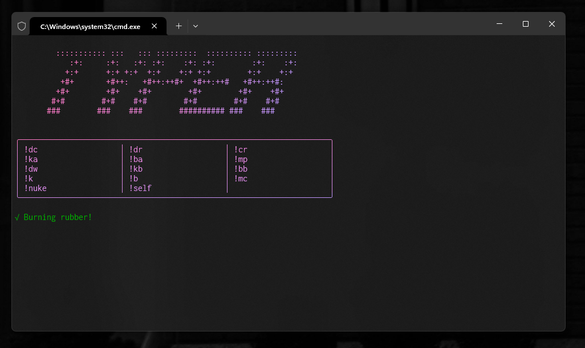

# TypeR nuker

TypeR is a POC discord nuking bot. This is an older project, I'm only open sourcing it to prove I have JS experience.



### Commands ⌨️

TypeR responds to the following commands;

- **`dc`**: Delete all channels
- **`dr`**: Delete all roles.
- **`cr <amount>`**: Creates roles
- **`ka`**: Kicks all users
- **`ba`**: Bans all users
- **`mp <amount>`**: Mention `@everyone` in each channel
- **`dw`**: Delete all webhooks.
- **`kb`**: Kicks all bots.
- **`bb`**: Bans all bots
- **`k <role name>`**: Kicks by role
- **`b <role name>`**: Bans by role
- **`mc <amount> [-v, -r]`**: Creates channels. Add `-v` for voice channels or `-r` for rand.
- **`nuke <channelsAmount> <mentionsAmount>`**: Self explan
- **`self`**: Create a special role for the user in config.ini and assign it

## Setup 🌐

### Prereqs 📚

- Node.js (v18.0.0 or later)
- npm (Node Package Manager)

### Installation 📂

1. **Clone the Repository**

   ```sh
   git clone <https://github.com/dutchpsycho/TypeR>
   cd <TypeR>
   ```

2. **Run the Installer Script**

   This script sets up the configuration file and installs all necessary dependencies.

   ```sh
   ./installer.sh or double click Installer.bat file if you're on Windows.
   ```

3. **Configure the Bot**

   Edit the `config.ini` file to include your bots token and settings.

   ```ini
   [settings]
   prefix=ur prefix (!)
   token=ur token
   operators=ur userid
   ```

4. **Start the Bot**

   Run the following command to start TypeR.

   ```sh
   ./TypeR.sh or double click TypeR.bat if you're on Windows.
   ```

## Disclaimer ⚠️

**WARNING**: This bot is intended for educational and ethical purposes only. Misuse of this bot, including deploying it on servers without proper authorization, can lead to severe consequences and is against Discord's TOS.
